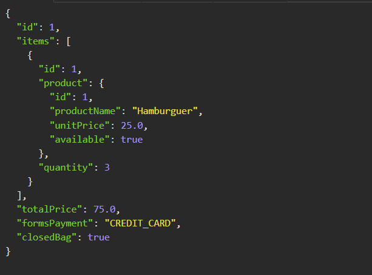

## iFood Dev Week 2022. 

Imersão pela Stack de Back-end Java com Spring Boot, construindo API REST, testando com Postman, documentando com Swagger.

Evento gratuito online disponibilizado pela DIO Digital Innovation One entre 26/09/2022 e 29/09/2022. O objetivo é desenvolver as etapas de um carrinho de compras para um e-commerce. 

Sacola API para Servir uma Aplicação com Domínio de Delivery

Projeto construído para fins educacionais.

### 26/09/2022 Lançamento iFood Dev Week

Dia 01 - iFood Dev Week - Evento de Lançamento
Dia 01 - Preparando o Ambiente de Setup

### 27/09/2022 Entendendo como Funciona o Fluxo de um Carrinho de Compras
Dia 02 - Conhecendo o Domínio da Aplicação e POO - Aula 01 

### 28/09/2022 Construindo Juntos a Aplicação na Prática
Dia 03 Construindo uma Rest API com Java e Spring Boot - Aula 02

- [x] Spring Initializr
- [x] Spring Web
- [x] Spring Data Jpa
- [x] Lombok
- [x] H2 Console
- [x] Enumerations
- [x] Models
- [x] Repositories

### 29/09/2022 Testando e Finalizando o Projeto
Dia 04 Documentação e Testes da API - Aula 03

- [x] Service Layer
- [x] Controller Layer
- [x] DTO (modelar o Json)
- [x] Documentação
- [x] Testes de requisição
- [x] Swagger 

### Api Test

[Projeto original](https://github.com/cami-la/sacola-api_IFOOD_DEV_WEEK)

Este repositório foi criado para fins didaticos/educacionais.
